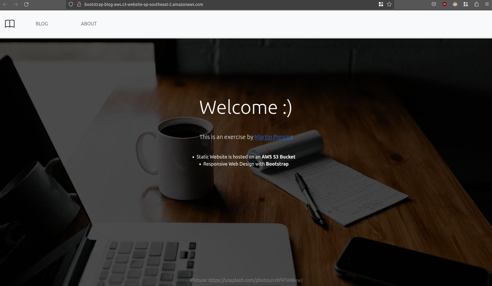
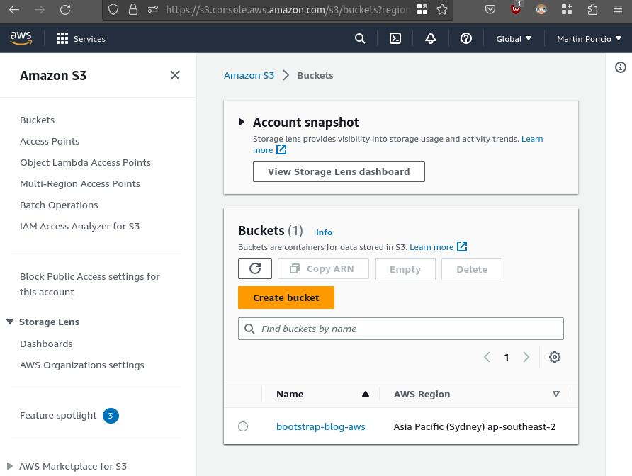
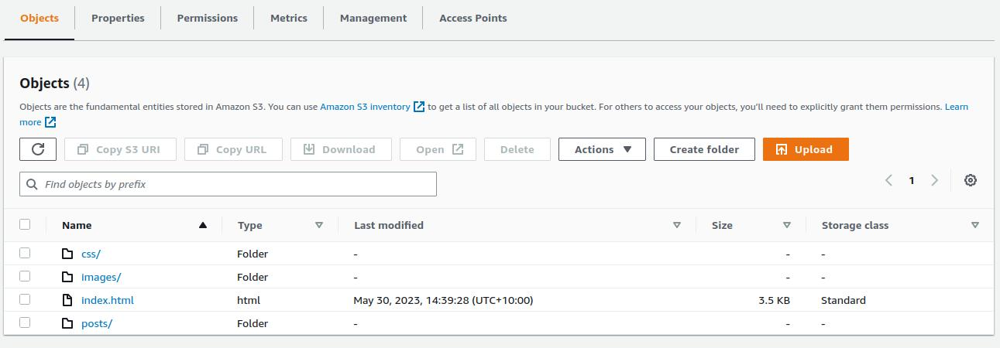
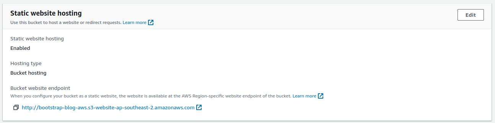

# AWS S3 Bucket Static Web Hosting - Bootstrap Blog 

As an exercise, I hosted an old project of mine (Bootstrap page) in an AWS S3 Bucket.

In this repository, I show the process I followed to host the website.

If you want to see the page [Click here](https://lmponcio.github.io/aws-s3-bootstrap-blog/) (now hosted on Github - I already removed it from AWS).

<a href="https://lmponcio.github.io/aws-s3-bootstrap-blog/">

</a>

## Hosting a Static Website 
#### Bucket Creation


#### Uploading files


#### Allow website hosting

#### Bucket Policy
```json
{
    "Version": "2012-10-17",
    "Id": "StaticWebPolicy",
    "Statement": [
        {
            "Sid": "S3GetObjectAllow",
            "Effect": "Allow",
            "Principal": "*",
            "Action": "s3:GetObject",
            "Resource": "<BUCKET_ARN_HERE>/*"
        }
    ]
}
```